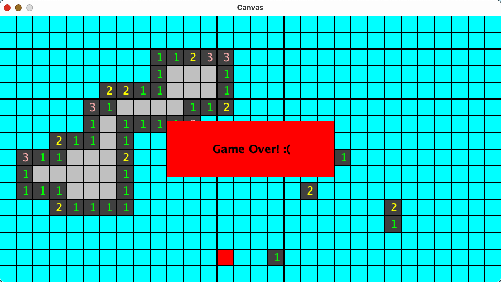

<h1 align="center">Minesweeper Game</h1>

For this project, I implemented a version of the classic game Minesweeper, popularized by Microsoft Windows 3.1. It features a grid of cells, each <i>potentially</i> hiding a mine. Players reveal cells by clicking, with outcomes being mine explosions or numbers indicating the location of nearby mines.

The player can reveal what’s in a cell by clicking on it with three possibilities. Right off the bat, if it contains a mine, the player loses. Second, if the cell is empty but it is adjacent to some mines, the revealed cell shows a number indicating how many of its neighboring cells contain a mine. Lastly, if the revealed cell is both empty and has no neighbors with a mine, then instead of showing a zero, all of its neighbors are revealed, as well. This creates cascading “flood-fill” effect where an entire region of connected cells without mines is uncovered.

<h4>How It's Made:</h4>

Tech Used: Java

## 🚨 Forking this repo

This code cannot be used for college assignments. I value keeping this code on github as part of my portfolio, but as you all know, <b>plagiarism is bad</b>. I spent a non-negligible amount of effort developing and designing this project and I am proud of it! All I ask is to not claim this effort as your own.

